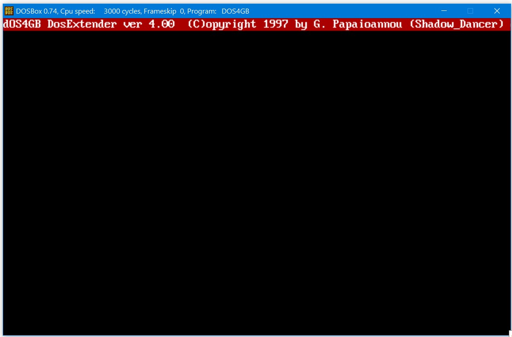

# DOS4GigaBytes
MS DOS Memory Extender (DPMI/VCPI/XMS/RAW)

DOS4GigaBytes ver 4.00 now supports DPMI/VCPI/XMS/RAW
Copyright by George Papaioannou (_Shadow Dancer)
Greece feb 1998

A few words
============
I made this extender for my purposes so do not expect to be a
a commercial program that it has anything you have dreamed about.
I released this program WITH the source code to learn about
protected mode (if you don’t know already) and why not if you prefer,
to build your programs under this extender.
I am using already my extender to make my own games and demos.

HISTORY
=======
My previously versions of DOS4GB ware just a flat models and nothing more.
I used them a lot for a small period of time but they just couldn’t work
with WIN95 or anything that used DPMI.
Before two months ago from now I have started to write my own extender
with the valueable help of the tran’s code. Anyway, I found many sources
out there and I learned a lot of them.

CREDITS
=======
I would like to thanx Lorenzo Micheletto, Tran (Thomas Pytel) and so many
other guys out there for their help.

PS:DosBox is crashing, but the old days I had been used a lot to my Apps. 
